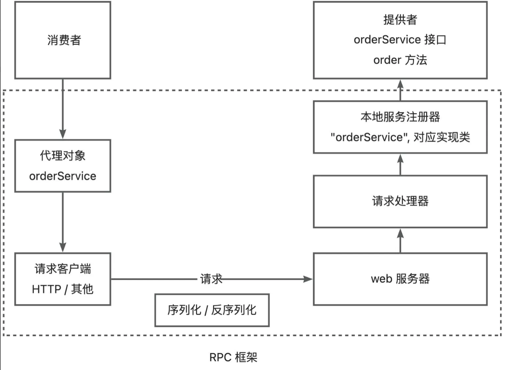
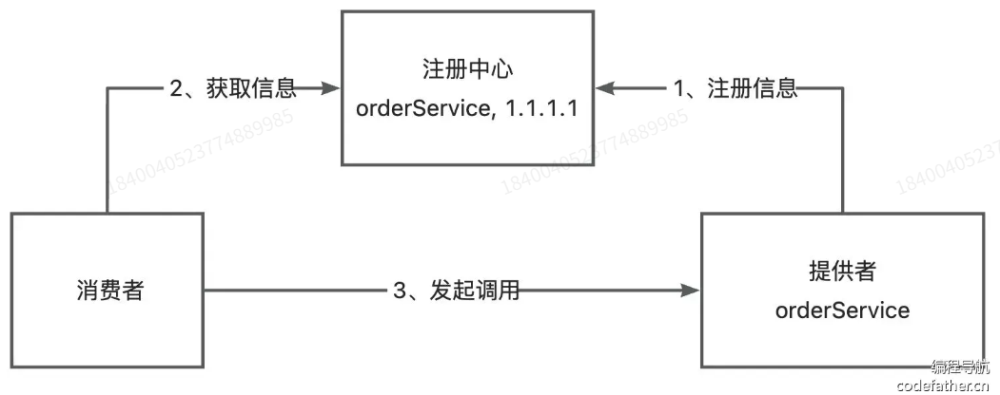
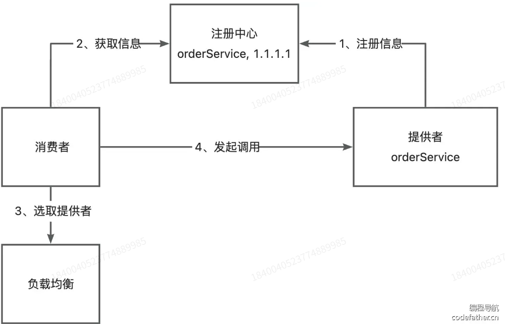
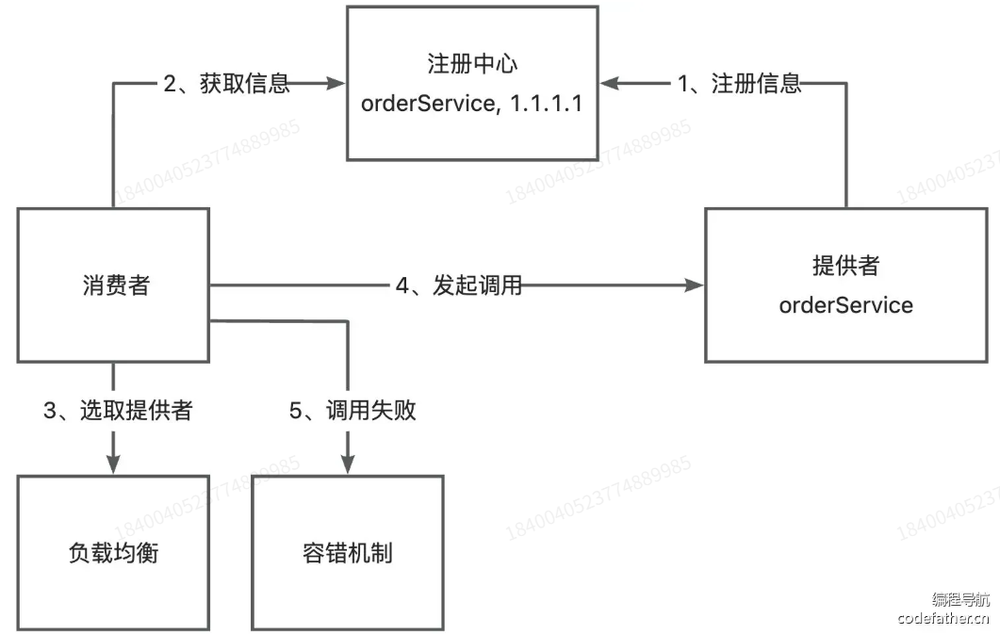
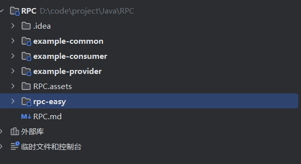
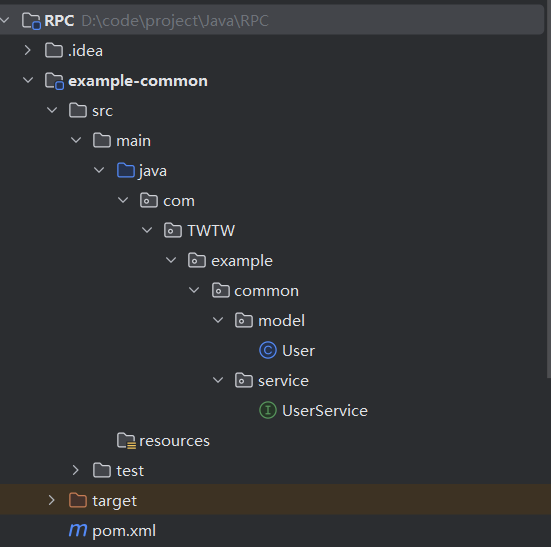
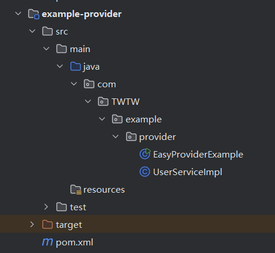
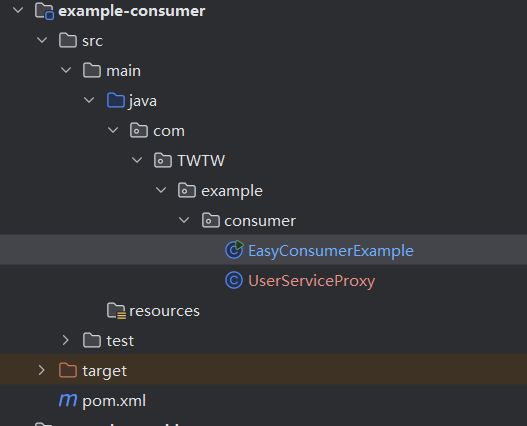
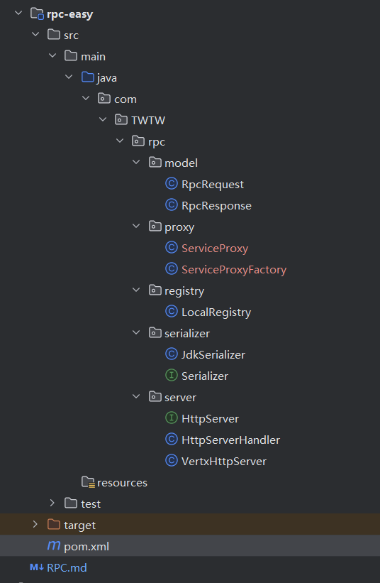

# RPC

## 一、RPC概念

[RPC协议_百度百科](https://baike.baidu.com/item/RPC协议/5019569)

全称：RPC 远程过程调用 (Remote Procedure Call Protocol)

1. **依赖底层传输协议**：假定 TCP、UDP 等传输协议的存在，以此为通信程序传递信息数据。
2. **跨网络层次**：在 OSI 网络通信模型中，跨越传输层和应用层。
3. **简化开发**：降低网络分布式多程序应用程序的开发难度。
4. 采用客户机 / 服务器模式：
   - 请求程序作为客户机，服务提供程序作为服务器。
   - 调用流程为：客户端发送带进程参数的调用信息→服务器等待调用信息→服务器接收后计算结果并发送答复→客户端接收答复继续执行。
5. 存在多种模式和实现：
   - 最初由 Sun 公司提出。
   - 经 IETF ONC 宪章修订后，ONC RPC 成为 IETF 标准协议。
   - 目前最普遍的是开放式软件基础的分布式计算环境（DCE）。
6. **信息协议结构明确**：由调用信息和答复信息两种不同结构组成。


### RPC的实现思路

RPC需要做的就是将请求的转化进行隐藏。



### 扩展设计

#### 1.服务注册与发现

消费者如何知道提供者的调用地址？



服务提供者向注册中心保存地址-》消费者向注册中心获取地址-》然后调用

#### 2.负载均衡

如果有多个服务提供者，可以轮询、随机、根据性能动态调用



#### 3.容错机制

失败重试，降级调用其他接口



4.其他

- 服务提供者下线了，需要一个失效节点剔除机制
- 服务消费者每次都从注册中心拉取信息，使用缓存优化性能
- RPC传输通讯性能，合适的网络框架，自定义协议头，节约传输体积
- 使整个框架更易扩展：SPI机制、配置化

## 二、RPC简易版

#### 1、初始化项目

在RPC项目下新建一个基本的Meven模块

- example-common：示例代码的公共依赖，包括接口、Model 等
- example-consumer：示例服务消费者代码
- example-provider：示例服务提供者代码
- yu-rpc-easy：简易版 RPC 框架



#### 2、公共模块

公共模块需‏要同时被消费者和服务提供者引入，主要是编写和服务相关的‌接口和数据模型。



用户类

```java
package com.TWTW.example.common.model;

import java.io.Serializable;

/**
 * @author TWTW
 * @version 1.0
 * 描述：公共模块的User 类 用来进行消息的传递所以需要序列化
 * @date 2025/6/28 上午11:17
 */

public class User implements Serializable {
    private String name;

    public String getName() {
        return name;
    }

    public void setName(String name) {
        this.name = name;
    }
}

```

用户接口类

```java
package com.TWTW.example.common.service;

import com.TWTW.example.common.model.User;

/**
 * @author TWTW
 * @version 1.0
 * 描述：用户接口类
 * @date 2025/6/28 上午11:19
 */
public interface UserService {
    /**
     * 获取用户
     *
     * @param user
     * @return
     */
    User getUser(User user) ;
}

```

#### 3、服务提供



添加相关的依赖

```xml
 <dependencies>
     <dependency>
         <groupId>com.dysf</groupId>
         <artifactId>rpc-easy</artifactId>
         <version>1.0-SNAPSHOT</version>
     </dependency>
     <dependency>
         <groupId>com.dysf</groupId>
         <artifactId>example-common</artifactId>
         <version>1.0-SNAPSHOT</version>
     </dependency>
     <!-- https://doc.hutool.cn/ -->
     <dependency>
         <groupId>cn.hutool</groupId>
         <artifactId>hutool-all</artifactId>
         <version>5.8.16</version>
     </dependency>
     <!-- https://projectlombok.org/ -->
     <dependency>
         <groupId>org.projectlombok</groupId>
         <artifactId>lombok</artifactId>
         <version>1.18.30</version>
         <scope>provided</scope>
     </dependency>

     <!-- https://mvnrepository.com/artifact/io.vertx/vertx-core -->
     <dependency>
         <groupId>io.vertx</groupId>
         <artifactId>vertx-core</artifactId>
         <version>4.5.1</version>
     </dependency>
</dependencies>
```

用户服务实现类

```java
package com.TWTW.example.provider;

import com.TWTW.example.common.model.User;
import com.TWTW.example.common.service.UserService;

/**
 * @author TWTW
 * @version 1.0
 * 描述：用户服务实现类
 * @date 2025/6/28 上午11:24
 */
public class UserServiceImpl implements UserService {
    public User getUser(User user) {
        System.out.println("用户名：" + user.getName());
        return user;
    }
}

```

简易服务提供者示例

```java
package com.TWTW.example.provider;

import com.TWTW.example.common.service.UserService;
import com.TWTW.rpc.registry.LocalRegistry;
import com.TWTW.rpc.server.HttpServer;
import com.TWTW.rpc.server.VertxHttpServer;

/**
 * @author TWTW
 * @version 1.0
 * 描述：简易服务提供者示例
 * @date 2025/6/28 上午11:26
 */

public class EasyProviderExample {

    public static void main(String[] args) {
        // 注册服务
        LocalRegistry.register(UserService.class.getName(), UserServiceImpl.class);

        // 启动 web 服务
        HttpServer httpServer = new VertxHttpServer();
        httpServer.doStart(8080);
    }
}
```

#### 4、服务消费



添加相关依赖

```xml
<dependencies>
    <dependency>
        <groupId>com.dysf</groupId>
        <artifactId>rpc-easy</artifactId>
        <version>1.0-SNAPSHOT</version>
    </dependency>
    <dependency>
        <groupId>com.dysf</groupId>
        <artifactId>example-common</artifactId>
        <version>1.0-SNAPSHOT</version>
    </dependency>
    <!-- https://doc.hutool.cn/ -->
    <dependency>
        <groupId>cn.hutool</groupId>
        <artifactId>hutool-all</artifactId>
        <version>5.8.16</version>
    </dependency>
    <!-- https://projectlombok.org/ -->
    <dependency>
        <groupId>org.projectlombok</groupId>
        <artifactId>lombok</artifactId>
        <version>1.18.30</version>
        <scope>provided</scope>
    </dependency>
</dependencies>
```

简易服务消费者示例

```java
package com.TWTW.example.consumer;

import com.TWTW.example.common.model.User;
import com.TWTW.example.common.service.UserService;
import com.TWTW.rpc.proxy.ServiceProxyFactory;

/**
 * @author TWTW
 * @version 1.0
 * 描述：简易服务消费者示例
 * @date 2025/6/28 上午11:29
 */

public class EasyConsumerExample {

    public static void main(String[] args) {
        // 动态代理
        UserService userService = ServiceProxyFactory.getProxy(UserService.class);

        User user = new User();
        user.setName("TWTW");
        // 调用
        User newUser = userService.getUser(user);
        if (newUser != null) {
            System.out.println(newUser.getName());
        } else {
            System.out.println("user == null");
        }
    }
}
```

#### 5、RPC



引入相关依赖

```xml
<dependencies>
    <!-- https://mvnrepository.com/artifact/io.vertx/vertx-core -->
    <dependency>
        <groupId>io.vertx</groupId>
        <artifactId>vertx-core</artifactId>
        <version>4.5.1</version>
    </dependency>
    <!-- https://doc.hutool.cn/ -->
    <dependency>
        <groupId>cn.hutool</groupId>
        <artifactId>hutool-all</artifactId>
        <version>5.8.16</version>
    </dependency>
    <!-- https://projectlombok.org/ -->
    <dependency>
        <groupId>org.projectlombok</groupId>
        <artifactId>lombok</artifactId>
        <version>1.18.30</version>
        <scope>provided</scope>
    </dependency>
</dependencies>
```

## 三、RPC-core

```
package com.yupi.example.provider;

import com.yupi.example.common.service.UserService;
import com.yupi.yurpc.RpcApplication;
import com.yupi.yurpc.registry.LocalRegistry;
import com.yupi.yurpc.server.HttpServer;
import com.yupi.yurpc.server.VertxHttpServer;

/**
 * 简易服务提供者示例
 */
public class ProviderExample {

    public static void main(String[] args) {
        // RPC 框架初始化
        RpcApplication.init();
        
        // 注册服务
        LocalRegistry.register(UserService.class.getName(), UserServiceImpl.class);

        // 启动 web 服务
        HttpServer httpServer = new VertxHttpServer();
        httpServer.doStart(RpcApplication.getRpcConfig().getServerPort());
    }
}

```

